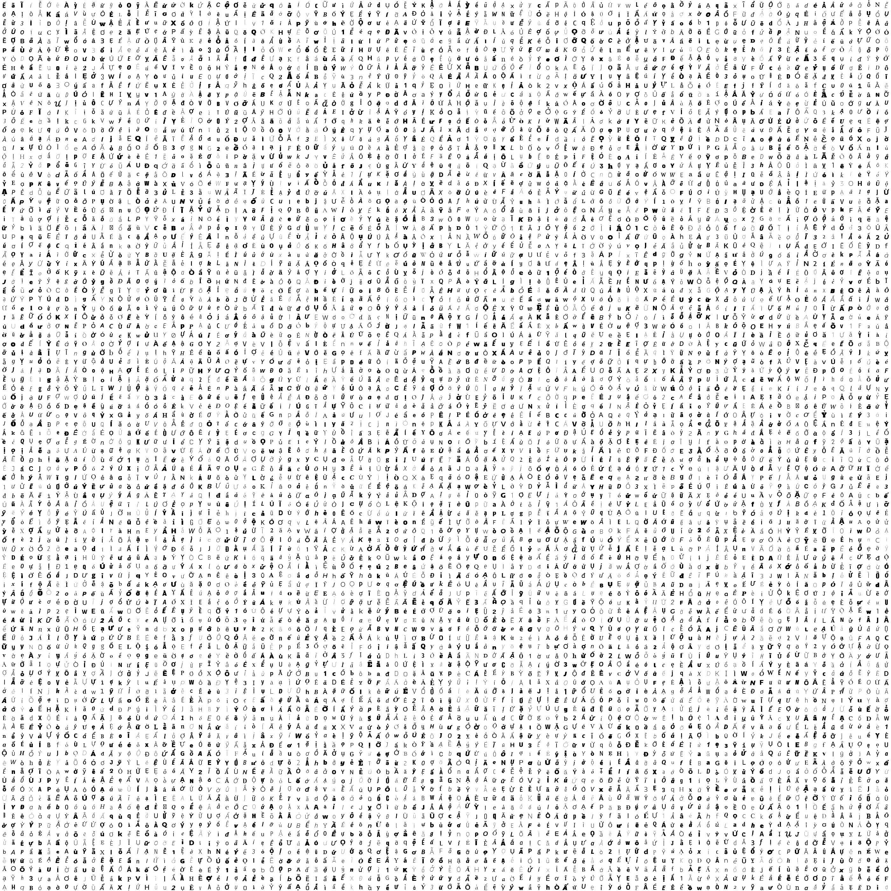

### VietnameseOCR - Vietnamese Optical Character Recognition

Apply Deep Learning ( CNN networks ) to train a model uses for recognizing Vietnamese characters, it works well with Latin characters.

### Dataset in big image ( 100.000 samples, 2800 x 2800 pixel)



### Requirements
```
python 3.6.5
tensorflow
PIL
```


### Model Summary

| Layer         | Shape 		 | 	Kernel   	  |    Stride 	  |   Padding 	|   	 	 |
| -------------:| --------------:|---------------:|--------------:|------------:|-----------:|
| INPUT     	| [28, 28, 1] 	 |			   	  | 			  |				|			 |
| CONV1			| 				 | [3, 3, 32, 32] |  	          |    		    |   	 	 |
| POOL1         |				 |				  |               |				|			 |
| CONV2		    |				 | [3, 3, 32, 64] |               |				|			 |
| POOL2			|				 |                |               |				|			 |
| CONV3			| 				 | [3, 3, 64, 128]|               |				|			 |
| POOL3			|				 |                |               |				|			 |
| FC1			| 				 |                |               |				|			 |
| FC2			| [625, 190]	 |                |               |				|			 |

<!---
### Results
#### Acurary
-->

### Generate Text Images
```
python generate_data.py
```

### Training
```
python train.py
```

### Further working
- Character classification. -> Done.
- Dataset augmentation.     
- Improve accuracy.
- Text location.
- Text recognition.
- Apply NLP for spell checking.

### References
1. STN-OCR https://arxiv.org/pdf/1707.08831.pdf
3. https://arxiv.org/abs/1708.08201

### Author mien.hust [at] gmail.com